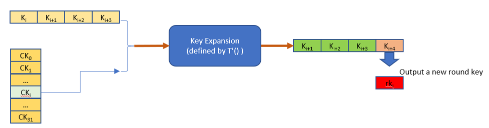
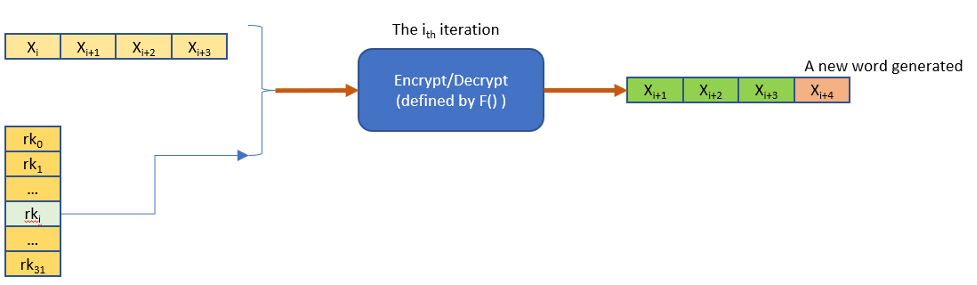

# 商用密码技术最佳实践白皮书

商用密码承载了国内数据和网络的基础安全使命，我们将商密软件栈 SIG 的技术和案例的沉淀做了整理汇总，挑选其中精华的内容形成了《商用密码技术最佳实践白皮书》，从社区，案例，技术全方位介绍了商用密码生态，为商密行业贡献出龙蜥力量。

特点：

* 覆盖全面：涵盖了从硬件、bootloader、内核、密码算法库到高级语言的商用密码尝试解读
* 案例丰富：来自多个领域的专家经验，贡献了丰富且接地气的商密案例
* 上手容易：商密技术由浅入深，附带大量的示例命令及代码，手把手带领读者从入门到实践

精华摘要：

商密软件栈 SIG 依托基础软件上游社区，秉承为已有轮子支持商密的原则，在全栈范围内的多个基础组件中实现了商密算法以及性能优
化，包括 **Linux 内核，OpenSSL，libgcrypt，gnulib，nettle** 等在内的基础组件，支持了商密算法以及大量的性能优化，并且得到
上游社区的支持进入主线，基本补齐了商密算法在基础软件中的一些短板，在兼容现有API的情况下，提供给普通开发者平滑的使用
体验。


------

SM4密码算法是一个分组算法。该算法的输入分组长度为128比特, 密钥长度为128比特。每次加解密都可以输出128比特。数据解密和数据加密的算法相同, 但解密轮密钥是加密轮密钥的逆序。

SM4算法主要分成两步，首先是每次密钥扩展会产生一个新的32b的轮密钥，迭代32次后会得到32个新的轮密钥用于后续的加解密处理。



对128b的分组数据进行加解密是使用上一步扩展出来的32个轮密钥rki进行32轮迭代，最后4轮迭代输出的4个字(128比特)就是密文或解压后的明文。下图是表示一次迭代的处理。



### 文档规范

文档以 Markdown 书写，使用 [mdBook](https://github.com/rust-lang/mdBook) 工具构建。

```
# install mdbook
cargo install mdbook
cargo install mdbook-template

# develop
mdbook serve --open

# build
mdbook build
```

### Contributing

这个仓库包含了龙蜥社区商密软件栈 SIG 的最新技术最佳实践。 用于向社区用户展示社区商密软件栈 SIG 的最新技术进展和实践。

龙蜥社区商密软件栈 SIG 主页：<https://openanolis.cn/sig/crypto>

OpenAnolis 是一个开放包容的社区，因此我们也欢迎志同道合之士参与我们的文档修订。

对于文档中您认为不足之处，欢迎新开issue，我们会第一时间进行响应。

另外，若您想更新文档，也同样欢迎提 PR。
