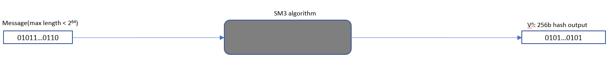

# 国密硬件加速与优化

性能是通用密码算法的一个重要工程指标，也是阻碍算法大规模应用的很重要一个衡量标准。

常用的密码算法经过验证后，算法本身是经久不变的，有着固定的输入输出，因此很容易作为固定的程序片断被固化到CPU或者外部集成电路上，固化到CPU上的往往表现为CPU
的扩展指令，比如x86上的AESNI指令，固化到外部集成电路上就成了支持算法加速的 PCIE 卡，比如QAT，CCP等。

算法的性能优化作为社区重点突破的方向，在x86和ARM架构上使用SIMD指令中实现了SM3和SM4算法性能的极大突破，

## 基于 CPU 指令集的国密算法优化

现代CPU中SIMD指令集是标准配置，各架构的SIMD指令也是大同小异，主流的密码算法，比如哈希算法和对称加密算法都是结构化的，因此使用 SIMD 来优化通用密码算法就是很自然的一个事情，事实上也有不错的优化效果。

可以认为AESNI是x86架构上专用用优化 AES 算法的SIMD指令，也常被用来间接优化其它算法，相比于通用的SIMD指令，专用指令能用更少的指令和时钟周期完成更多的操作，也会带来更大的性能提升。类似的，arm64架构上也提供了专用的 `Crypto Extension` 扩展，为主流的对称算法和哈希算法都提供了支持，也包括SM3和SM4算法。

本小节会以armv8架构为例来介绍国密算法的指令集优化。

### ARM 架构下国密算法的优化

为了提升国密算法的性能，Arm公司开发者基于Armv8.2中定义的`Cryptographic Extension`中的对国密SM3, SM4算法的硬件加速，实现了指令级的优化，获得了较好的性能提升。目前该优化在OpenSSL，libgcrypt和Linux内核中已经合入主线。

> 🟢 **SM3 在 Arm 架构上的优化实现**

SM3密码杂凑算法用来将一个长度为l（l < 2^64）的比特消息串进行填充和迭代压缩，生成256比特的杂凑值。SM3通常应用在数字签名和验证、消息认证码的生成与验证以及随机数的生成。具体算法参见[**SM3 密码杂凑算法规范**](https://www.oscca.gov.cn/sca/xxgk/2010-12/17/1002389/files/302a3ada057c4a73830536d03e683110.pdf)。SM3算法基本过程如下图：



其中的黑盒SM3算法如下图。其中扩展和压缩都是基于一个256b的B(i)块来描述相应的处理。


第一步是将输入消息按照一定规则末尾填充一些比特，使得总比特长度为512的倍数。

第二步是对填充后的消息按512b分块，对每个数据块B(i)按32b的字长分为16个字作为促使输入，依照P1(X)函数定义操作进行52次迭代扩展分别得到第16到67个字，然后使用0~67个字经过异或后生成最后的64个字的输出。

第三步是以每个B(i)块在第二步生成的128个字(去掉其中的64~67)  和 256b的向量V(i)作为输入进行64轮的迭代，生成一个新的 256b的V(i+1)作为下一次循环的输入向量。直到最后一个B块完成处理后得到的最后一个256b向量为SM3的最终hash 值。

##### Arm SM3指令

Arm SM3指令是Armv8.2引入的七条基于ASIMD的加密扩展指令，支持对SM3 hash算法的硬件加速。

消息扩展的处理由SM3PARTW1和SM3PARTW2配合完成，一次指令配对执行将并发完成4次P1(X)的处理而生成4个扩展字。对于一个B(i)块的扩展需要循环13次。

<div align=center>

</div>

数据压缩 CF(V(i), B(i))需要64次循环完成，每次循环中的压缩处理由余下5条指令完成。

SM3SS1一次对3个字的数据完成压缩函数中的SS1运算，输出一个字作为后续其它压缩处理的输入。

SM3TT1A完成前16次循环所定义的TT1运算，而SM3TT1B完成后面48次循环所定义的TT1运算，输出的数据作为下一轮TT1运算的输入。每次执行完成对多个输入的字数据的并行处理。

SM3TT2A完成前16次循环中所定义的的TT2运算和准备下一轮TT2运算的输入数据，而SM3TT2B完成后面48次循环中定义的TT2运算。

可见SM3的压缩处理因为存在依赖而无法一次循环运算而完成多个256b的向量V(i)的输出。

##### SM3 优化效果

以下是在阿里云倚天710上的benchmark数据，SM3与SHA256哈希算法的软件实现（无优化）与Cryptographic Extension指令集优化后的性能对比：

<div align=center>

</div>

##### SM3 优化总结

具体在OpenSSL中对SM3算法的优化参见[**OpenSSL SM3 优化实现**](https://github.com/openssl/openssl/blob/master/crypto/sm3/asm/sm3-armv8.pl)。从上面的描述可见，相关的指令都是借助了ASIMD中的128b vector寄存器，一次执行处理多个数据字，从而获得较好的并发度。其中压缩处理因为循环之间存在数据依赖，没法如同消息扩展的处理达到一次完成多个输出字的效果。

> 🟢 **SM4 在 Arm 架构上的优化实现**

SM4密码算法是一个分组算法。该算法的输入分组长度为128比特, 密钥长度为128比特。每次加解密都可以输出128比特。数据解密和数据加密的算法相同, 但解密轮密钥是加密轮密钥的逆序。

SM4算法主要分成两步，首先是每次密钥扩展会产生一个新的32b的轮密钥，迭代32次后会得到32个新的轮密钥用于后续的加解密处理。


对128b的分组数据进行加解密是使用上一步扩展出来的32个轮密钥rki进行32轮迭代，最后4轮迭代输出的4个字(128比特)就是密文或解压后的明文。下图是表示一次迭代的处理。


SM4算法中每次迭代的具体描述可以参看[**SM4分组加密算法规范**](http://www.gmbz.org.cn/upload/2018-04-04/1522788048733065051.pdf)。

##### Arm SM4指令

FEAT_SM4优化引入的两条可选加密扩展指令，同样是基于ASIMD技术来提升处理的并行度。其中指令`SM4EKEY`一次执行能扩展出来4个新的轮密钥，8次执行后就完成了所有32个轮密钥的生成。指令`SM4E`具有类似的并行度，每次执行能加解密出来4个字的数据，同样的8次执行后就能完成一个分组的加解密。

##### SM4 优化效果

以下是在阿里云倚天710上的benchmark数据，SM4与AES对称加密算法的软件实现（无优化）与Cryptographic Extension指令集优化后的性能对比：


##### SM4 优化总结

具体在OpenSSL中对SM4算法的优化补丁参见[**OpenSSL SM4优化实现**](https://github.com/openssl/openssl/blob/master/crypto/sm4/asm/sm4-armv8.pl)。基于上面的描述，优化的主要有：

* 借助SM4指令的SIMD属性一次执行完成多个字数据的处理。
* 每个SM4指令一次执行能并行完成4个期待的输出，减少了循环次数。
* 对于可以并行的分组加密模式，比如SM4-CTR, SM4-ECB等，可以对4个分组进行SM4计算，充分地利用流水线，让计算可以并行进行。

除此之外，Arm公司开发者还进一步提升了SM4-GCM的性能。考虑到FEAT-SM4是可选的架构特性，在某些SoC中不一定支持，Arm公司开发者基于Neon指令实现了Armv8下的SM4，从而在没有FEAT-SM4的设备上也能获得相当的提升。

从性能上来说SM4指令的使用可以大幅地提升性能。从安全性来说，硬件指令集成了S盒替换的功能，使得这部分计算变成了时间一致的操作，大大减小了侧信道攻击的可能性，保证了算法的安全。

## 密码加速器 - 海光密码技术（HCT）

### 简介

海光密码技术HCT（Hygon Cryptographic Technology）是基于海光芯片密码协处理器以及密码指令集特性，自主设计研发的一套密码算法加速软件开发套件。

官方发布的 HCT 密码计算套件位于 gitee 的 `hygon-devkit` 仓库，地址：<https://gitee.com/anolis/hygon-devkit.git>

```sh
git clone https://gitee.com/anolis/hygon-devkit.git
```

HCT密码计算套件的目录结构示意图如下：

```
hygon-devkit/
  ├─ hct
  ├──pkg
  │  ├── hct_x.x.x.xxxxxxxx_alpha
  │  └── hct_x.x.x.xxxxxxxx_release
  ├── readme
  ├── sample
  └── script
```

* pkg目录：内含各版本hct密码计算套件（上述示意图中的x.x.x.xxxxxxxx代表版本信息）。
* sample目录：内含使用hct密码套件的示例程序代码。
* script目录：内含一些工具脚本。
* readme文件：有关HCT的简单情况及使用说明。

### 测试与开发

#### 环境配置

安装支持HCT的内核，参考[安装开源OS镜像并编译软件页面](https://conf.hygon.cn/pages/viewpage.action?pageId=76487872 )进行内核的编译与安装。完成内核安装后，重启系统，选择刚才安装的内核启动。

按如下流程必要的模块跟依赖：

```sh
# 1. 检测并安装必须的内核模块 
modprobe vfio vfio-pci vfio_iommu_type1 mdev vfio_mdev

# 2. 安装需要依赖的软件库

# numa 库
yum install numactl -y

# openssl 库
wget https://www.openssl.org/source/old/1.1.1/openssl-1.1.1c.tar.gz
tar –zxvf openssl-1.1.1c.tar.gz
cd openssl-1.1.1c
./config
make
sudo make install

# Tips：HCT套件中的部分工具脚本需要用到uuidgen工具，安装方式如下。
yum install util-linux -y

# 3. 安装HCT开发套件

cd hct/pkg/hct_1.0.0.20230224_rc
./config 
sudo make install
```

#### 测试

* 功能测试

  ```sh
  cd /opt/hygon/hct/bin/hct/test
  ./hct_test
  ```

* 性能测试

  ```sh
  cd /opt/hygon/hct/bin
  ./hct_speed -elapsed -engine hct –multi 128 –seconds 60 sm2enc
  ./hct_speed -elapsed -engine hct –multi 128 –seconds 60 sm2sign
  ./hct_speed -elapsed -engine hct –multi 128 –seconds 60 –bytes 1024 -evp sm3
  ./hct_speed -elapsed -engine hct –multi 128 –seconds 60 –bytes 1024 -evp sm4
  ```

### hctconfig 服务命令

HCT套件成功安装后，会在系统中增加一个hctconfig服务命令。通过hctconfig服务可以方便的管理CCP协处理器的绑定情况：

1. 使用默认配置，将 CCP 协处理器绑定至最佳性能状态：`service hctconfig start`
2. 利用status参数查看HCT的相关状态信息及CCP协处理的绑定情况：`service hctconfig status`
3. 利用rebond命令对CCP协处理器进行重新绑定：`service hctconfig rebond`

***Tips：start命令和rebond的命令都可以带参数，详情可参考 usage 命令***：`service hctconfig usage`

### 开发

HCT通过 openssl 标准接口（EVP）向应用提供接口，使用HCT套件时，通过e=ENGINE_by_id（"hct"）选择密码引擎为hct，然后直接通过openssl标准（EVP）接口即可完成对hct密码计算套件的调用。

### 卸载HCT套件

在对应HCT版本包内执行make uninstall即可卸载HCT套件

```sh
hct/pkg/hct_1.0.0.20230224_rc
make uninstall
```

### 其它注意事项

如果BIOS支持，可以将PSP CCP配置给C86使用，BIOS设置步骤如下：

1. 进入BIOS，选择“HYGON CBS”，进入“Moksha Common Options”
2. 在“Available PSP CCP VQ Count”中输入4

**说明：海光CPU芯片中包含两类CCP协处理器，一类为PSP CCP，一类为NTB CCP，通常BIOS只会将NTB CCP配置给用户使用，PSP CCP一般用于可信计算场景。如果BIOS支持将PSP CCP配置给用户（C86）使用，那么HCT就可以获得更多的协处理器资源，表现出更高的性能。**

hct的正确执行依赖内核的iommu功能，所以需要使能内核的iommu功能

hygon CPU上启动内核的命令行参数参考如下：

```
amd_iommu=on iommu=pt
```

{{#template template/footer.md}}
