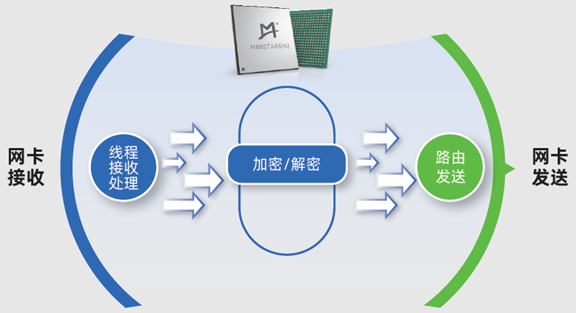
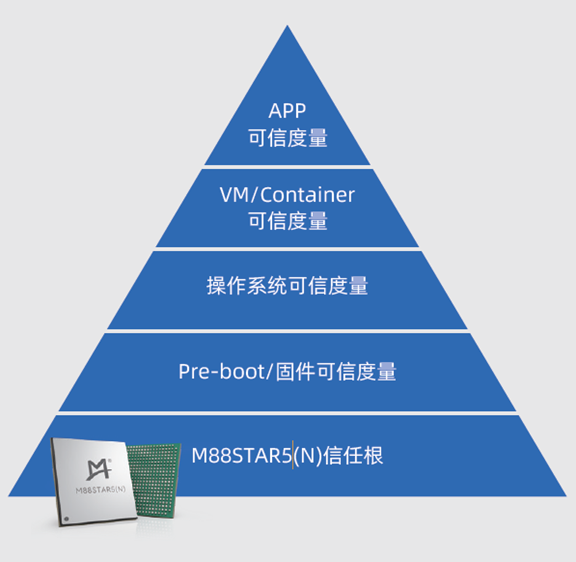
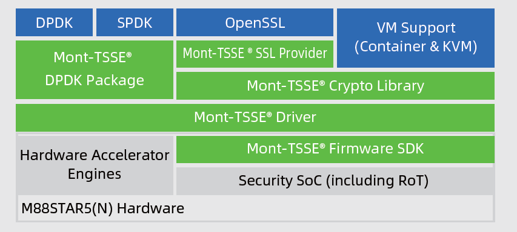

# 澜起高性能加解密和可信计算芯片 - M88STAR5(N)

M88STAR5(N)芯片是澜起科技在数据保护和平台可信度量领域多年沉淀的产品化成果。凭借其创新的Mont-TSSE可信安全系统扩展架构和技术，澜起将硬件级数据加解密和平台可信度量两大核心功能无缝融合于这一颗单一芯片之上。该芯片硬件支持国密和国际主流加解密算法加速，片内集成了多个TRNG，搭配PCIe 5.0接口可提供高达160Gbps的吞吐量。芯片采用紧凑型封装，可直接安装于服务器主板之上，或通过AIC卡的方式集成多颗芯片，实现加密处理能力的倍增。同时，芯片兼容TPM、TCM和TPCM等可信计算相关标准，可作为硬件信任根（HRoT）使用，满足可信平台3.0规范的需求。澜起提供芯片配套的SDK和评估板，为客户在其现有系统平台上部署可信计算度量和加解密加速功能，提供了经济高效的一体化解决方案。

## 算法支持

| 算法 | 模式和类型                        |
| ---- | --------------------------------- |
| SM4  | ECB/CBC/CFB/GCM/XTS/OFB/CTR/GMAC  |
| AES  | ECB/CBC/CFB/GCM/XTS/OFB/CTR/GMAC  |
| SM2  | SIGN/VERIFY/ENC/DEC/kG/kP         |
| RSA  | 1024/2048/3072/4096               |
| SM3  | HASH/HMAC                         |
| SHA  | 256/384/512 HASH/HMAC             |
| ECC  | SECP256R1/SECP256K1/SECP384R1     |
| TRNG | 多个，符合商密安全芯片要求        |


## 典型应用场景

### 加解密场景

* DPDK
* SPDK
* 分布式文件系统加密
* 数据库加密
* HTTPS加密加速

<div align=center>

</div>

### 可信度量场景

* 高性能、高安全的硬件信任根，支持硬件虚拟化应用
* 兼容TPM/TCM/TPCM标准，满足可信平台3.0规范需求
* 支持动态度量卸载及弹性功耗控制机制，优化系统资源利用

<div align=center>

</div>

## 软件开发工具包

<div align=center>

</div>

* Mont-TSSE Firmware SDK：安全固件软件开发工具包（Zephyr Based）
* Mont-TSSE Driver：Linux硬件驱动层
* Mont-TSSE DPDK Package：DPDK驱动接口
* Mont-TSSE Crypto Library：高性能加解密库
* Mont-TSSE SSL Provider：OpenSSL Engine接口
官方发布的Mont-TSSE密码计算套件位于gitee的Mont-TSSE仓库

## 测试与开发

### 环境搭建

在安装软件包之前需打开Intel VT-d和SR-IOV。

* 安装依赖：

```
meson
ninja
pyt
hon3
pyelftools
numactl
numactl-devel
```

* 安装Mont-TSSE Driver

1.安装Mont-TSSE Driver，可在gitee代码仓库上下载。最新的龙蜥操作系统已经包含Mont-TSSE Driver无需重复安装

2.安装Mont-TSSE DPDK Package，可从gitee上下载RPM包安装

* 绑定VFIO

```
sudo modprobe vfio_pci
echo 4096 > /proc/sys/vm/nr_hugepages
lspci -d 1b00:d021      # 查询BDF
sudo /usr/local/bin/dpdk-devbind.py -b vfio-pci  $BDF
```

### 测试

* 功能测试

```
sudo ./build/app/dpdk-test-crypto-perf \
    -l 1-2 -a 15:00.1  -- --ptest verify \
    --devtype crypto_tsse --optype aead \
    --aead-algo sm4-gcm --aead-op encrypt \
    --aead-key-sz 16 --aead-iv-sz 12 --aead-aad-sz 16 \
    --total-ops 8 --burst-sz 8 --test-name aead_buff_64 \
    --test-file ./app/test-crypto-perf/data/sm4_gcm.data
```

* 性能测试

```
sudo ./build/app/dpdk-test-crypto-perf \
    -l 1-5 -a 15:00.1  -- --ptest throughput \
    --devtype crypto_tsse --optype aead \
    --aead-algo sm4-gcm --aead-op encrypt \
    --aead-key-sz 16 --aead-iv-sz 12 --aead-aad-sz 16 \
    --total-ops 81920 --buffer-sz 1440 --burst-sz 32
```

{{#template template/footer.md}}
