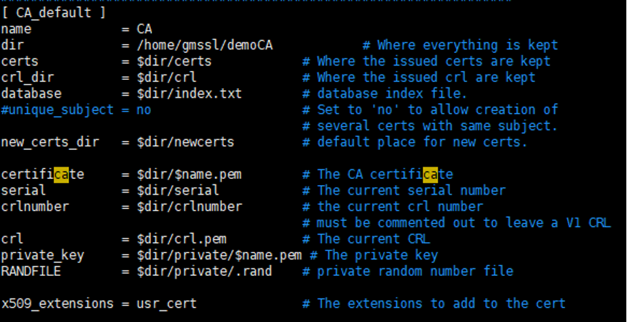

# Web 服务国密双证书支持

## GMSSL

GmSSL 是一个开放源代码加密工具包，它提供对GM / T 串行标准中指定的中国国家加密算法和协议的第一级支持。作为OpenSSL项目的一个分支，GmSSL提供与OpenSSL的API级别兼容性并维护所有功能。在此感谢贡献，该项目地址：<https://github.com/guanzhi/GmSSL>

## 准备环境

下载 GmSSL 的代码，参考官网方法编译以及配置 PATH 变量：

```shell
# 下载代码
git clone https://github.com/guanzhi/GmSSL

# 编译安装
cd GmSSL
./config --prefix=/usr/local/gmssl
make
make install

# 配置环境变量，使shell能找到的gmssl文件
export PATH=/usr/local/gmssl/bin:$PATH
export LD_LIBRARY_PATH=/usr/local/gmssl/lib:$LD_LIBRARY_PATH
```

`openssl.cnf` 位于 `/usr/local/gmssl/ssl` 下，可以按需修改生成各种文件位置、信息等等，需要注意的是生成证书、私钥的位置、名称要与openssl中保持一致。

openssl.cnf的部分配置，详细配置可以参考：



准备主配置文件：

```shell
# 创建根目录
mkdir -p /home/gmssl/demoCA
cd /home/gmssl/demoCA
mkdir certs crl newcerts private

# 在此路径下要创建好/usr/local/gmssl/ssl/openssl.cnf中需要的
# certs， crl ，new_certs_dir和private_key的子目录
# 默认是newcerts和private

touch index.txt

echo '01' > serial
```

## 生成国密证书

生成根证书：

```sh
# 生成私钥key
gmssl ecparam -genkey -name sm2p256v1 -text \
    -out CA.key -config /usr/local/gmssl/ssl/openssl.cnf

# 生成证书签名请求
gmssl req -new -key CA.key -out Root.req

# 生成根证书
gmssl x509 -req -days 3650 -sm3 -in Root.req \
    -signkey Root.key -out RootCA.crt
```

生成服务端证书：

```sh
# 生成私钥
gmssl ecparam -genkey -name sm2p256v1 -text -out Server.key

# 证书请求
gmssl req -new -key Server.key -out Server.csr \
    -subj /C=CN/ST=Beijing/L=Beijing/O=CSG/OU=WangAn (GM)/CN=*.vpn.test.cn \
    -config /usr/local/gmssl/ssl/openssl.cnf

# 签发证书
gmssl x509 -req -sm3 -days 3650 -CA RootCA.crt \
    -CAkey Root.key -CAcreateserial \
    -in Server.req -out ServerCA.crt

# 证书验证
gmssl verify -CAfile RootCA.crt ServerCA.crt
```

生成客户端证书：

```sh
# 生成私钥
gmssl ecparam -genkey -name sm2p256v1 -text \
    -out Client.key -config /usr/local/gmssl/ssl/openssl.cnf

# 生成客户证书请求
gmssl req -new -key Client.key -out Client.req \
    -subj /C=CN/ST=Beijing/L=Beijing/O=CSG/OU=WangAn (GM)/CN=*.vpn.test.cn \
    -config /usr/local/gmssl/ssl/openssl.cnf

# 签发证书
gmssl x509 -req -sm3 -days 3650 -CA RootCA.crt \
    -CAkey demoCA/private/Root.key -CAcreateserial \
    -in Client.req -out Client.crt

# 证书验证
gmssl verify -CAfile RootCA.crt Client.crt
```

生成国密双证书的完整脚本：

```sh
#!/bin/sh
# gen GM certificate files

GmsslRootPath=/usr/local/gmssl
CONF_FILE=${GmsslRootPath}/apps/openssl.cnf
DemoCaDir=${GmsslRootPath}/apps/demoCA/

CertDir=${DemoCaDir}/certs/
KeyDir=${CertDir}/keys/
ReqDir=${DemoCaDir}/reqs/

SUBJ_STR=" /C=CN/ST=Beijing/L=Beijing/O=CSG/OU=WangAn (GM)/CN=*.vpn.test.cn"

CACert=${CertDir}/CA.cert.pem
CAKey=${KeyDir}/CA.key.pem
CAReq=${ReqDir}/CA.req

SSCert=${CertDir}/SS.cert.pem
SSKey=${KeyDir}/SS.key.pem
SSReq={ReqDir}/SS.req

SECert=${CertDir}/SE.cert.pem
SEKey=${KeyDir}/SE.key.pem
SEReq=${ReqDir}/SE.req

CSCert=${CertDir}/CS.cert.pem
CSKey=${KeyDir}/CS.key.pem
CSReq=${ReqDir}/CS.req

CECert=${CertDir}/CE.cert.pem
CEKey=${KeyDir}/CE.key.pem
CEReq=${ReqDir}/CE.req

export LD_LIBRARY_PATH=/usr/local/gmssl/lib

rm -rf "${GmsslRootPath}/apps/demoCA/"

mkdir -p "${CertDir}" "${KeyDir}" "${ReqDir}"

# 生成 CA 证书文件

gmssl ecparam -name sm2p256v1 -out "${DemoCaDir}/SM2.pem"

gmssl req -config "${CONF_FILE}" -nodes \
    -subj "${SUBJ_STR}" -keyout "${CAKey}" \
    -newkey "ec:${DemoCaDir}/SM2.pem" -new -out "${CAReq}"

gmssl x509 -sm3 -req -days 10000 -in "${CAReq}" \
    -extfile "${CONF_FILE}" -extensions v3_ca \
    -signkey "${CAKey}" -CAcreateserial -out "${CACert}"

# 生成服务端签名证书

gmssl req -config "${CONF_FILE}" -nodes \
    -subj "${SUBJ_STR}" -keyout "${SSKey}" \
    -newkey "ec:${DemoCaDir}/SM2.pem" -new -out "${SSReq}"

gmssl x509 -sm3 -req -days 10000 -in "${SSReq}" \
    -CA "${CACert}" -CAkey "${CAKey}" -extfile "${CONF_FILE}" \
    -extensions v3_req -CAcreateserial -out "${SSCert}"

# 生成服务端加密证书

gmssl req -config "${CONF_FILE}" -nodes \
    -subj "${SUBJ_STR}" -keyout "${SEKey}" \
    -newkey "ec:${DemoCaDir}/SM2.pem" -new -out "${SEReq}"

gmssl x509 -sm3 -req -days 10000 -in "${SEReq}" \
    -CA "${CACert}" -CAkey "${CAKey}" -extfile "${CONF_FILE}" \
    -extensions v3_req -CAcreateserial -out "${SECert}"

# 生成客户端签名证书

gmssl req -config "${CONF_FILE}" -nodes \
    -subj "${SUBJ_STR}" -keyout "${CSKey}" \
    -newkey "ec:${DemoCaDir}/SM2.pem" -new -out "${CSReq}"

gmssl x509 -sm3 -req -days 10000 -in "${CSReq}" \
    -CA "${CACert}" -CAkey "${CAKey}" -extfile "${CONF_FILE}" \
    -extensions v3_req -CAcreateserial -out "${CSCert}"

# 生成客户端加密证书

gmssl req -config "${CONF_FILE}" -nodes \
    -subj "${SUBJ_STR}" -keyout "${CEKey}" \
    -newkey "ec:${DemoCaDir}/SM2.pem" -new -out "${CEReq}"

gmssl x509 -sm3 -req -days 10000 -in "${CEReq}" \
    -CA "${CACert}" -CAkey "${CAKey}" -extfile "${CONF_FILE}" \
    -extensions v3_req -CAcreateserial -out "${CECert}"
```

生成证书注销列表的脚本代码：

```sh
GmsslRootPath=/usr/local/gmssl
DemoCaDir=${GmsslRootPath}/apps/demoCA
CertDir=${DemoCaDir}/certs

if [ -z "$1" ]; then
    echo "Usage: "`basename "$0"`" cert0 [cert1 cert2 ...]"
fi

touch "${DemoCaDir}/index.txt"
touch "${DemoCaDir}/index.txt.attr"

echo 01 > "${DemoCaDir}/crlnumber"

cd "${DemoCaDir}/.."

until [ $# -eq 0 ] do
    gmssl ca -revoke "${CertDir}/$1" \
        -keyfile "${CertDir}/keys/CA.key.pem" \
        -cert "${CertDir}/CA.cert.pem"

    shift
done

gmssl ca -gencrl -keyfile "${CertDir}/keys/CA.key.pem" \
    -cert "${CertDir}/CA.cert.pem" -out "${DemoCaDir}/crl/gm_cert.crl"
```

下面是最终在`/usr/local/gmssl/apps`下生成的目录结构：

```shell
$ tree
.
|-- demoCA
|   |-- certs
|   |   |-- CA.cert.pem
|   |   |-- CA.srl
|   |   |-- CE.cert.pem
|   |   |-- CS.cert.pem
|   |   |-- keys
|   |   |   |-- CA.key.pem
|   |   |   |-- CE.key.pem
|   |   |   |-- CS.key.pem
|   |   |   |-- SE.key.pem
|   |   |   `-- SS.key.pem
|   |   |-- SE.cert.pem
|   |   `-- SS.cert.pem
|   |-- crl
|   |   `-- gm_cert.crl
|   |-- crlnumber
|   |-- index.txt
|   |-- index.txt.attr
|   |-- reqs
|   |   |-- CA.req
|   |   |-- CE.req
|   |   |-- CS.req
|   |   |-- SE.req
|   |   `-- SS.req
|   `-- SM2.pem
`-- openssl.cnf
```

## 配置 Nginx 支持双证书协议

无缝 nginx 国密改造，支持 nginx 1.6+ 版本，本例以 nginx 1.8.0 为例说明。

1. 下载 nginx 代码
2. 编辑`auto/lib/openssl/conf`，将全部`$OPENSSL/.openssl/`修改为`$OPENSSL/`并保存
3. 按如下指令编译安装

    ```sh
    ./configure \
        --without-http_gzip_module \
        --with-http_ssl_module \
        --with-http_stub_status_module \
        --with-http_v2_module \
        --with-file-aio \
        --with-openssl="/usr/local/gmssl" \
        --with-cc-opt="-I/usr/local/gmssl/include" \
        --with-ld-opt="-lm"

    make
    make install
    ```

    注：可能需要使用 `yum install pcre-devel` 安装 pcre-devel 依赖包。

安装成功后，根据情况选择以下的配置后，即可启动支持国密双证书的 Web 服务。

配置示例 (国密单向)

```nginx
server {
    listen 0.0.0.0:443 ssl;

    ssl_protocols TLSv1 TLSv1.1 TLSv1.2;
    ssl_ciphers ECDHE-RSA-AES128-GCM-SHA256:AES128-SHA:DES-CBC3-SHA:ECC-SM4-CBC-SM3:ECC-SM4-GCM-SM3;
    ssl_verify_client off;

    ssl_certificate /usr/local/nginx/conf/demo1.sm2.sig.crt.pem;
    ssl_certificate_key /usr/local/nginx/conf/demo1.sm2.sig.key.pem;

    ssl_certificate /usr/local/nginx/conf/demo1.sm2.enc.crt.pem;
    ssl_certificate_key /usr/local/nginx/conf/demo1.sm2.enc.key.pem;

    location / {
        root html;
        index index.html index.htm;
    }
}
```

配置示例 (国密双向)

```nginx
server {
    listen 0.0.0.0:443 ssl;

    ssl_protocols TLSv1 TLSv1.1 TLSv1.2;
    ssl_ciphers ECDHE-RSA-AES128-GCM-SHA256:AES128-SHA:DES-CBC3-SHA:ECC-SM4-CBC-SM3:ECC-SM4-GCM-SM3;
    ssl_client_certificate /usr/local/nginx/conf/demo1.sm2.trust;
    ssl_verify_client on;

    ssl_certificate /usr/local/nginx/conf/demo1.sm2.sig.crt.pem;
    ssl_certificate_key /usr/local/nginx/conf/demo1.sm2.sig.key.pem;

    ssl_certificate /usr/local/nginx/conf/demo1.sm2.enc.crt.pem;
    ssl_certificate_key /usr/local/nginx/conf/demo1.sm2.enc.key.pem;

    location / {
        root html;
        index index.html index.htm;
    }
}
```

配置示例 (国密 / RSA 单向自适应)

```nginx
server {
    listen 0.0.0.0:443 ssl;

    ssl_protocols TLSv1 TLSv1.1 TLSv1.2;
    ssl_ciphers ECDHE-RSA-AES128-GCM-SHA256:AES128-SHA:DES-CBC3-SHA:ECC-SM4-CBC-SM3:ECC-SM4-GCM-SM3;
    ssl_verify_client off;

    ssl_certificate /usr/local/nginx/conf/demo1.rsa.crt.pem;
    ssl_certificate_key /usr/local/nginx/conf/demo1.rsa.key.pem;
    ssl_certificate /usr/local/nginx/conf/demo1.sm2.sig.crt.pem;
    ssl_certificate_key /usr/local/nginx/conf/demo1.sm2.sig.key.pem;
    ssl_certificate /usr/local/nginx/conf/demo1.sm2.enc.crt.pem;
    ssl_certificate_key /usr/local/nginx/conf/demo1.sm2.enc.key.pem;

    location / {
        root html;
        index index.html index.htm;
    }
}
```

{{#template ../template/footer.md}}
