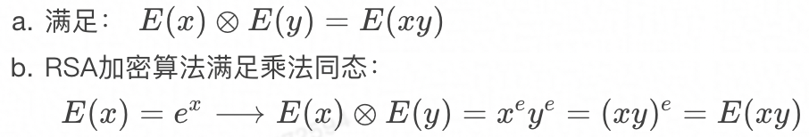

# 同态算法

**数据不出域、可用不可见**

## 背景

随着大数据与人工智能的快速发展，个人隐私数据泄露和滥用时有发生，隐私安全问题也越来越被重视。

国家于 2020 年施行密码法、2021 年施行个人信息保护法，对个人隐私数据和数据安全加密有更高的要求。

因此，隐私计算也不断地被提及和关注，源于其有优秀的数据保护作用，使得『数据不出域，可用不可见』，限定了数据的使用场景，防止了数据的泄露，而引起了业界的热捧。

隐私计算是指在保护数据本身不对外泄露的前提下，实现数据共享和计算的技术集合，共享数据价值，而非源数据本身，实现数据可用不可见。

- 隐私计算对于个人用户来说，有助于保障个人信息安全；
- 对于企业来说，隐私计算是数据协作过程中履行数据保护义务的关键路径；
- 对于政府来说，隐私计算实现数据价值最大化的重要支撑。

隐私计算目前在金融、医疗、电信、政务等领域均在开展应用试验，比如：

* 银行和金融机构： 在不泄露各方原始数据的前提下，进行分布式模型训练，可以有效降低信贷、欺诈等风险；
* 医疗机构： 无需共享原始数据便可进行联合建模和数据分析，数据使用方在不侵犯用户隐私的情况下，可以使用建模运算结果数据，有效推动医疗行业数据高效利用。

隐私计算的相关技术有多方安全计算（MPC）、可信执行环境（TEE）、联邦学习（FL）、同态加密（HE）、差分隐私（DP）、零知识证明（ZKP）、区块链（BC）等等。

这些技术各有优缺点，隐私计算的产品或者平台也是由这些技术来搭建。

其中与密码学明显相关的是同态加密，目前同态加密算法的开源项目各有千秋，用户使用比较复杂。Tongsuo 作为基础密码库，应该提供一套简单易用和高效的同态加密算法实现和接口，让上层应用更方便简单地使用同态加密算法。

## 同态加密

同态加密（Homomorphic Encryption, HE）是指满足密文同态运算性质的加密算法，按性质分为加法同态和乘法同态：

**加法同态**


**乘法同态**



同态加密后得到密文数据，对密文数据进行同态加法或者乘法得到密文结果，将密文结果同态解密后可以得到原始数据直接加法或者乘法的计算结果。

如下图：


根据满足加法和乘法的运算次数又分为：全同态加密和半同态加密。


- 全同态加密（Fully Homomorphic Encryption, FHE）

    * 支持任意次的加法和乘法运算
    * 难实现、性能差（密钥过大，运行效率低，密文过大）
    * 主流算法：Gentry、BFV、BGV、CKKS

- 半同态加密（Partially Homomorphic Encryption, PHE）

    * 只支持加法或乘法中的一种运算，或者可同时支持有限次数的加法和乘法运算
    * 原理简单、易实现、性能好
    * 主流算法：RSA、ElGamal、Paillier

半同态加密需要实现的接口：

* KeyGen()：密钥生成算法，用于产生加密数据的公钥 PK（Public Key）和私钥 SK（Secret Key），以及一些公共参数 PP（Public Parameter）。
* Encrypt()：加密算法，使用 PK 对用户数据 Data 进行加密，得到密文 CT（Ciphertext）。
* Decrypt()：解密算法，使用 SK 对密文 CT 解密得到数据原文 PT（Plaintext）。
* Add()：密文同态加法，输入两个 CT 进行同态加运算。
* Sub()：密文同态减法，输入两个 CT 进行同态减法算。
* ScalaMul() 或者 Mul()：密文同态标量乘法，输入一个 CT 和一个标量 PT，计算 CT 的标量乘结果。

## 半同态算法 EC-ElGamal

ElGamal 加密算法是基于 Diffie-Hellman 密钥交换的非对称加密算法，EC-ElGamal 是 ECC 的一种，是把 ElGamal 移植到椭圆曲线上来的实现，主要计算有：椭圆曲线点加、点减、点乘、模逆和离散对数。

以下是铜锁中实现的相关接口：

> 🟢 **上下文对象**

EC_ELGAMAL_CTX，该对象用来保存公私钥以及一些其他内部用到的信息，是 EC-ElGamal 算法其他接口的第一个参数。

接口如下：

```c
//创建 EC_ELGAMAL_CTX 对象，key 为 ECC 公钥或者私钥的 EC_KEY 对象
EC_ELGAMAL_CTX *EC_ELGAMAL_CTX_new(EC_KEY *key);

//释放 EC_ELGAMAL_CTX 对象
void EC_ELGAMAL_CTX_free(EC_ELGAMAL_CTX *ctx);
```

> 🟢 **解密表对象**

EC_ELGAMAL_DECRYPT_TABLE，该对象用来保存解密表的内部信息。椭圆曲线离散对数问题（ECDLP）只有爆力破解的方法可求解，而爆力破解的速度比较慢，通常的做法是使用小步大步算法（Baby-Step，Giant-Step，BSGS）。总体思想是提前将所有可能的明文结果提前运算后，保存到 hash 表中，下次只需要进行少量的运算和 hash 表查找就可以得到结果，大大提高 ECDLP 的解密效率。但解密表的初始化可能比较慢，而且解密表的实现事关解密速度，后面考虑可以开放接口的实现给上层应用，所以这里先定义了一个解密表的对象和默认实现。

接口如下：

```c
//创建 EC_ELGAMAL_DECRYPT_TABLE 对象
//decrypt_negative 为 1 时表示该解密表可以解密负数，
//初始化解密表时将可能的负数运算后插入到 hash 中。
EC_ELGAMAL_DECRYPT_TABLE *
EC_ELGAMAL_DECRYPT_TABLE_new(EC_ELGAMAL_CTX *ctx, int32_t decrypt_negative);

//释放 EC_ELGAMAL_DECRYPT_TABLE 对象
void EC_ELGAMAL_DECRYPT_TABLE_free(EC_ELGAMAL_DECRYPT_TABLE *table);

//设置 EC_ELGAMAL_DECRYPT_TABLE 对象到上下文对象中
//解密时如果存在解密表则使用解密表进行求解，否则直接爆力破解，速度会很慢
void EC_ELGAMAL_CTX_set_decrypt_table(EC_ELGAMAL_CTX *ctx,
                                      EC_ELGAMAL_DECRYPT_TABLE *table);
```

> 🟢 **密文对象**

EC_ELGAMAL_CIPHERTEXT，由上面原理可知，加密之后得到的结果是两个点，该对象是用来保存加密后的密文信息（两个点），加密/解密和。

接口如下：

```c
//创建 EC_ELGAMAL_CIPHERTEXT 对象
EC_ELGAMAL_CIPHERTEXT *EC_ELGAMAL_CIPHERTEXT_new(EC_ELGAMAL_CTX *ctx);

//释放 EC_ELGAMAL_CIPHERTEXT 对象
void EC_ELGAMAL_CIPHERTEXT_free(EC_ELGAMAL_CIPHERTEXT *ciphertext);
```

> 🟢 **加密/解密接口**

```c
//加密，将明文 plaintext 进行加密，结果保存到 EC_ELGAMAL_CIPHERTEXT 对象指针 r 中
int EC_ELGAMAL_encrypt(EC_ELGAMAL_CTX *ctx,
        EC_ELGAMAL_CIPHERTEXT *r, int32_t plaintext);

//解密，将密文 ciphertext 进行解密，结果保存到 int32_t 指针 r 中
int EC_ELGAMAL_decrypt(EC_ELGAMAL_CTX *ctx,
        int32_t *r, EC_ELGAMAL_CIPHERTEXT *ciphertext);
```

> 🟢 **密文加/减/标量乘运算接口**

```c
//密文加，r = c1 + c2
int EC_ELGAMAL_add(EC_ELGAMAL_CTX *ctx, EC_ELGAMAL_CIPHERTEXT *r,
                   EC_ELGAMAL_CIPHERTEXT *c1, EC_ELGAMAL_CIPHERTEXT *c2);

//密文减，r = c1 - c2
int EC_ELGAMAL_sub(EC_ELGAMAL_CTX *ctx, EC_ELGAMAL_CIPHERTEXT *r,
                   EC_ELGAMAL_CIPHERTEXT *c1, EC_ELGAMAL_CIPHERTEXT *c2);

//标量密文乘，r = m * c
int EC_ELGAMAL_mul(EC_ELGAMAL_CTX *ctx, EC_ELGAMAL_CIPHERTEXT *r,
                   EC_ELGAMAL_CIPHERTEXT *c, int32_t m);
```

> 🟢 **编码/解码接口**

同态加密涉及到多方参与，可能会需要网络传输，这就将密文对象 EC_ELGAMAL_CIPHERTEXT 编码后才能传递给对方，对方也需要解码得到 EC_ELGAMAL_CIPHERTEXT 对象后才能调用其他接口进行运算。

接口如下：

```c
//编码，将密文 ciphertext 编码后保存到 out 指针中，out 指针的内存需要提前分配好；
//如果 out 为 NULL，则返回编码所需的内存大小；
//compressed 为是否采用压缩方式编码
//  1 为压缩编码（编码结果长度较小）
//  0 为正常编码（编码结果长度较大）
size_t EC_ELGAMAL_CIPHERTEXT_encode(EC_ELGAMAL_CTX *ctx,
        unsigned char *out, size_t size,
        EC_ELGAMAL_CIPHERTEXT *ciphertext, int compressed);

//解码，将长度为 size 的内存数据 in 解码后保存到密文对象 r 中
int EC_ELGAMAL_CIPHERTEXT_decode(EC_ELGAMAL_CTX *ctx,
        EC_ELGAMAL_CIPHERTEXT *r, unsigned char *in, size_t size);
```

### 核心实现

Tongsuo 是 OpenSSL 的衍生版，内部支持了很多椭圆曲线算法的实现。

比如，已支持国际（prime256v1、secp384r1 等）和国密（SM2）的大部分椭圆曲线，天生实现了椭圆曲线点运算、公私钥生成等基础算法，所以在 Tongsuo 实现 EC-ElGamal 算法的核心实现主要是 EC-ElGamal 原理的实现和 ECDLP 求解算法的实现。

## 半同态算法 Paillier

Paillier 和 EC-ElGamal 半同态加密算法，是隐私计算领域应用比较广泛的两个算法，它们接口类似且只支持加法同态。

但是它们两者的性能和原理有很大的差异：

**原理方面**，Paillier 是基于复合剩余类的困难性问题 （大数分解难题） 的公钥加密算法，有点类似 RSA；而 EC-ElGamal 是基于椭圆曲线数学理论的公钥加密算法，其安全性理论上要比 Paillier 要更好。

**性能方面**，EC-ElGamal 的加密和密文加法性能要比 Paillier 好；而 Paillier 的解密和密文标量乘法性能要比起 EC-ElGamal 要更好更稳定 （EC-ElGamal 的解密性能与解密的数字大小有关系，数字越大可能需要解密的时间越长，这与 EC-ElGamal 解密用到的解密表有关系，而 Paillier 的解密就没有这个问题。） 。

所以这两个算法各有优劣，大家可以根据自己的业务特点选择使用 Paillier 还是 EC-ElGamal。

以下是铜锁中实现的相关接口：

> 🟢 **对象相关接口**

**公/私钥对象**：PAILLIER_KEY ，该对象用来保存 Paillier 公钥和私钥的基本信息，比如 p、q、n、g、λ、μ 等信息，私钥保存所有字段，公钥只保存 n、g，其他字段为空或者 0。相关接口如下：

```c
// 创建 PAILLIER_KEY 对象
PAILLIER_KEY *PAILLIER_KEY_new(void);

// 释放 PAILLIER_KEY 对象
void PAILLIER_KEY_free(PAILLIER_KEY *key);

// 拷贝 PAILLIER_KEY 对象，将 src 拷贝到 dest 中
PAILLIER_KEY *PAILLIER_KEY_copy(PAILLIER_KEY *dest, PAILLIER_KEY *src);

// 复制 PAILLIER_KEY 对象
PAILLIER_KEY *PAILLIER_KEY_dup(PAILLIER_KEY *key);

// 将 PAILLIER_KEY 对象引用计数加1，释放 PAILLIER_KEY 对象时若引用计数不为0则不能释放其内存
intPAILLIER_KEY_up_ref(PAILLIER_KEY *key);

// 生成 PAILLIER_KEY 对象中的参数，bits 为随机大素数 p、q 的二进制位长度
int PAILLIER_KEY_generate_key(PAILLIER_KEY *key, int bits);

// 获取 key 的类型：公钥 or 私钥
// PAILLIER_KEY_TYPE_PUBLIC 为私钥，PAILLIER_KEY_TYPE_PRIVATE 为私钥
int PAILLIER_KEY_type(PAILLIER_KEY *key);
```

**上下文对象**：PAILLIER_CTX，该对象用来保存公私钥对象以及一些其他内部用到的信息，是 Paillier 算法其他接口的第一个参数。相关接口如下：

```c
// 创建 PAILLIER_CTX 对象，key 为 paillier 公钥或者私钥，
// threshold 为支持最大的数字阈值，加密场景可设置为 0，解密场景可使用默认值：
PAILLIER_MAX_THRESHOLDPAILLIER_CTX *
PAILLIER_CTX_new(PAILLIER_KEY *key, int64_t threshold);

// 释放 PAILLIER_CTX 对象
void PAILLIER_CTX_free(PAILLIER_CTX *ctx);

// 拷贝 PAILLIER_CTX 对象，将 src 拷贝到 dest 中
PAILLIER_CTX *PAILLIER_CTX_copy(PAILLIER_CTX *dest, PAILLIER_CTX *src);

// 复制 PAILLIER_CTX 对象
PAILLIER_CTX *PAILLIER_CTX_dup(PAILLIER_CTX *src);
```

**密文对象**：PAILLIER_CIPHERTEXT ，该对象是用来保存 Paillier 加密后的结果信息，用到 PAILLIER_CIPHERTEXT 的地方，可调用如下接口：

```c
// 创建 PAILLIER_CIPHERTEXT 对象
PAILLIER_CIPHERTEXT *PAILLIER_CIPHERTEXT_new(PAILLIER_CTX *ctx);

// 释放 PAILLIER_CIPHERTEXT 对象
void PAILLIER_CIPHERTEXT_free(PAILLIER_CIPHERTEXT *ciphertext);
```

> 🟢 **加密/解密接口**

```c
// 加密，将明文 m 进行加密，结果保存到 PAILLIER_CIPHERTEXT 对象指针 out 中
int PAILLIER_encrypt(PAILLIER_CTX *ctx,
        PAILLIER_CIPHERTEXT *out, int32_t m);

// 解密，将密文 c 进行解密，结果保存到 int32_t 指针 out 中
int PAILLIER_decrypt(PAILLIER_CTX *ctx,
        int32_t *out, PAILLIER_CIPHERTEXT *c);
```

> 🟢 **密文加/减/标量乘运算接口**

```c
// 密文加，r = c1 + c2
int PAILLIER_add(PAILLIER_CTX *ctx, PAILLIER_CIPHERTEXT *r,
                 PAILLIER_CIPHERTEXT *c1, PAILLIER_CIPHERTEXT *c2);

// 密文标量加，r = c1 * m
int PAILLIER_add_plain(PAILLIER_CTX *ctx, PAILLIER_CIPHERTEXT *r,
                       PAILLIER_CIPHERTEXT *c1, int32_t m);

// 密文减，r = c1 - c2
int PAILLIER_sub(PAILLIER_CTX *ctx, PAILLIER_CIPHERTEXT *r,
                 PAILLIER_CIPHERTEXT *c1, PAILLIER_CIPHERTEXT *c2);

// 密文标量乘，r = c * m
int PAILLIER_mul(PAILLIER_CTX *ctx, PAILLIER_CIPHERTEXT *r,
                 PAILLIER_CIPHERTEXT *c, int32_t m);
```

> 🟢 **编码/解码接口**

同态加密涉及到多方参与，可能会需要网络传输，这就需要将密文对象 PAILLIER_CIPHERTEXT 编码后才能传递给对方，对方也需要解码得到 PAILLIER_CIPHERTEXT 对象后才能调用其他接口进行运算。

接口如下：

```c
// 编码，将密文 ciphertext 编码后保存到 out 指针中，out 指针的内存需要提前分配好；
// 如果 out 为 NULL，则返回编码所需的内存大小；
// flag：标志位，预留，暂时没有用
size_t PAILLIER_CIPHERTEXT_encode(PAILLIER_CTX *ctx, unsigned char *out, 
                                  size_t size,
                                  const PAILLIER_CIPHERTEXT *ciphertext,
                                  int flag);

// 解码，将长度为 size 的内存数据 in 解码后保存到密文对象 r 中
int PAILLIER_CIPHERTEXT_decode(PAILLIER_CTX *ctx, PAILLIER_CIPHERTEXT *r,
                               unsigned char *in, size_t size);
```

### Paillier 命令行

为了提高 Paillier 的易用性，Tongsuo 实现了如下 Paillier 子命令：

```shell
$ /opt/tongsuo-debug/bin/openssl paillier -help
Usage: paillier [action options] [input/output options] [arg1] [arg2]

General options:
-help         Display this summary
Action options:
-keygen       Generate a paillier private key
-pubgen       Generate a paillier public key
-key          Display/Parse a paillier private key
-pub          Display/Parse a paillier public key
-encrypt      Encrypt a number with the paillier public key, usage: -encrypt 99, 99 is an example number
-decrypt      Decrypt a ciphertext using the paillier private key, usage:-decrypt c1, c1 is an example ciphertext
-add          Paillier homomorphic addition: add two ciphertexts, usage: -add c1 c2, c1 and c2 are tow example ciphertexts, result: E(c1) + E(c2)
-add_plain    Paillier homomorphic addition: add a ciphertext to a plaintext, usage: -add_plain c1 99, c1 is an example ciphertext, 99 is an example number, result: E(c1) + 99
-sub          Paillier homomorphic subtraction: sub two ciphertexts, usage: -sub c1 c2, c1 and c2 are tow example ciphertexts, result: E(c1) - E(c2)
-mul          Paillier homomorphic scalar multiplication: multiply a ciphertext by a known plaintext, usage: -mul c1 99, c1 is an example ciphertext, 99 is an example number, result: E(c1) * 99

Input options:
-in val       Input file
-key_in val   Input is a paillier private key used to generate public key

Output options:
-out outfile  Output the paillier key to specified file
-noout        Don't print paillier key out
-text         Print the paillier key in text
-verbose      Verbose output

Parameters:
arg1          Argument for encryption/decryption, or the first argument of a homomorphic operation
arg2          The second argument of a homomorphic operation
```

通过以上命令即可在命令行进行 Paillier 算法实验，降低入门门槛。

另外还实现了 Paillier 的 speed 命令，可以进行性能测试，详情请查阅相关代码和文档。

{{#template ../template/footer.md}}
