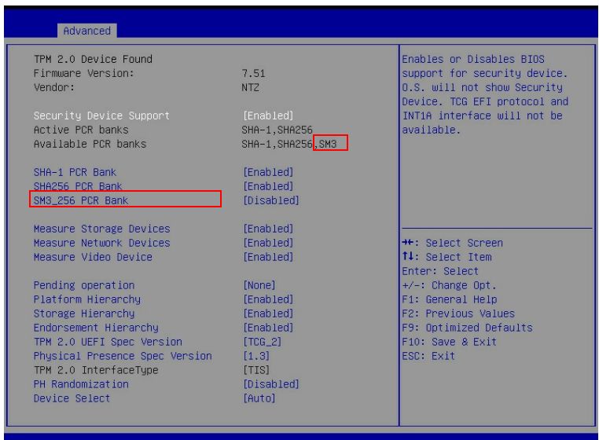

# 国密可信计算

## TPM、TCM 与国密算法

可信平台模块始于2000年可信计算平台联盟（Trusted Computing Platform Alliance）制定的 TPM 1.0 规范. 2003 年, TCG(trusted computing group) 成立, 修改完成了 TPM 1.1 规范, 2004 年发布了 TPM 1.2, 2014 年发布了 TPM 2.0 规范.

鉴于可信计算技术对国家信息安全体系的重要性, 经国家密码管理局批准, 中国于2006年成立了可信计算密码专项组, 并于2008年12月更名为中国可信计算工作组(China TCM Union), 简称 TCMU. 2007年12月, 国家密码管理局颁布了《可信计算密码支撑平台功能与接口规范》, 将国内使用的可信基础模块定义为 TCM(trust cryptography module).相较于TPM, TCM采用了我国《商用密码管理条例》中规定的 SM2、SM3 等国密算法, 同时引入了对称密钥算法, 简化了TPM中复杂的密钥管理.TCM的证书认证机制采用签名密钥以及加密密钥的双证书机制, 将对称密钥与非对称密钥结合保护系统安全, 在密钥管理体系和基础密码服务体系等方面进行了改进, 提升了系统的安全性.TPM和TCM的构成和功能类似, 提供可信计算平台的信任根(RTS, RTR), 是由CPU、存储器、I/O、密码协处理器、随机数产生器和嵌入式操作系统等部件组成的独立 SoC 芯片, 具备可信度量的存储、可信度量的报告、密钥产生、加密和签名、数据安全存储等功能.

2015年 TPM 2.0 library specification（Trusted Platform Module）正式成为国际标准 ISO/IEC 11889，吸纳了 TCM 中相关的安全改进，并首次成体系支持中国密码算法体系，包括 SM2/SM3/SM4 密码算法。这是中国密码算法技术和标准的又一次重要突破，也是中国信息安全标准在国际标准化工作中的重要进展。ISO/IEC 11889 支持中国商用密码算法体系（SM2/SM3/SM4），使得在数据安全保护上更加牢不可破。

## TPM 2.0

TPM (Trusted Platform Module) 2.0是遵循 ISO/IEC 11889 系列标准的可信根、由国际可信计算组织 TCG（Trusted Computing Group）维护。如下图所示，密码学系统是TPM2.0核心、其所有安全功能均以密码学系统为基础。


目前TPM2.0支持SM2.SM3、SM4特性，具体包括基于SM3的Hash算法、支持SM3 bank的PCR extend；支持SM4加解密；支持SM2加解密、SM2签名验签、SM2+SM3证书签名验签。

龙蜥OS为客户提供了两种使用TPM国密算法引擎的途径：TSS(TrustedSoftwareStack)提供的API访问TPM国密算法、TPMtools中的密码指令使用TPM提供的国密算法

以下示例为使用tpmtools创建基于SM2+SM3-256的认证密钥。

```sh
h_ek_persistent_ecc=0x81010002

tpm2_createak -C ${h_ek_persistent_ecc} -G ecc -g sm3_256 \
    -s sm2 -c ak_ecc.ctx -u ak_ecc.pub -n ak_ecc.name -T device
```

## UEFI 可信启动（Trusted Boot）

可信启动（TrustedBoot)是以可信根为核心、检测系统启动过程中所加载和使用的组件、确保预期的组件在预期的节点加载运行。


使用国密可信启动的条件如下：

* 硬件要具备的特性：
  - 服务器或计算机固件（UEFI）支持基于国密的可信度量特性
  - 服务器集成了TPM2.0芯片（该芯片许支持SM3、PCR SM3 Bank等特性
* OS 要具备的特性：
  - 部署支持基于国密可信启动的引导程序（grub）
  - 部署可信启动策略管理工具（iTrustMidware)
  - **说明**：当以上组件可从Inspur KOS获取，Inspur KOS V5.8是浪潮信息基于龙蜥开源社区最新技术成果自主研发的一款服务器操作系统

1）BIOS国密可信度量Enable方法：需要将 SM3_256 PCR Bank 改为Enable



2）OS国密可信度量组件部署方法：

```sh
# grub2系列所有组件（如grub2、grbu2-common、grub2-efi-x64等）均需部署
rpm -ivh grub2-xxx.anolis.x86_64.rpm
rpm -ivh iTrustMidware-3.0.1-20220827200013.kos.x86_6.rpm
```

3）部署上述组件后、默认支持kernel、initramfs、grubcmdline的国密可信度量


4）如需添加对特定系统程序或配置文件的度量需要进一步配置策略

```shell
> tlcptool
1. Check Policy State.
2. Turn on Supervisory Policy.
3. Update Supervisory Policy.
4. Turn on Interception Policy.
5. Update Interception Policy.
6. Turn off Policy.
7. Export BootLoader Passphrase.
8. Deploy Measurement File.
9. Update Measurement File.
10. Delete Measurement File.
11. Export Software Trusted Report.
O.Exit.
Please Input the Corresponding Operations.
```

5）如需添加启动控制策略（在可信度量的基础上、基于国密进一步进行可信验证、需要配置可信启动控制策略。

6）度量结果查看：

直接在 `/sys/kernel/security/tpm0/binary_bios_measurements` 查看（以下是输出的部分片断）：

```
0	0d818d47f8b73f1ae27dd82cdcc265aebfd79fd007ab65571c6822c7caacabd0 [S-CRTM Version]
0	b16790da86a87f9b4cb58f8ae0685c21190efdcc8e90f411fd32edecb84f35bf [POST CODE]
7	c3e86209704b2133d5f77fba5ffa3e04ef633729b1ea6086dc6584956db47b6d [EV_EFI_VARIABLE_DRIVER_CONFIG] SecureBoot
7	205702258aeaecaf68533e90c2c6cb17cdc1bc34f5c99e0564bb57f5ed3a0e27 [EV_EFI_VARIABLE_DRIVER_CONFIG] (null)
7	afcc870fa20c507995499794371e8c25e3a7310fa72200c109379973ae236845 [SEPARATOR]
2	0e9c74fcdf311f1e4b3e317b28de5e9e4d1463468204d8ae8db7768ddd1f38ef [EV_EFI_BOOT_SERVICES_DRIVER]

... ...

8	de8564716bef9c6c971ba04f50bcd1b10a20e103a4b0d8c9fb218b92c1f715fc [IPL] grub_cmd insmod all_video
8	c9eef8824efbf671f25251594d2318ea8ba13a7c03eab76a6ffc70148059b9ad [IPL] grub_cmd set gfx_payload=keep
8	6a1007c86dc8ee319275e7f0638668cfbba0eb3dfb974d2bd8d37dc0433d8fd9 [IPL] grub_cmd insmod gzio
8	eb204c91fc3dcc42968f4110285d3c265ec735943cf3b34f5b5992cccd07b1a0 [IPL] grub_cmd linux (hd0,gpt2)/vmlinuz-4.18.0 root=/dev/sda2 ro
9	3e9ff31a468703754a43ae6fc3a20d4ba8fdb3e38b2a94daa5044ad0da4628a0 [IPL] grub_linuxefi Kernel
8	603cfbaa83759e9579df8526a21093c4e9851ff3bdd7c40a1284cae6467c0fae [IPL] grub_cmd initrd (hd0,gpt2)/initramfs-4.18.0.img
9	f0ba7132cceaea8cb7ea4066406099d48b7ff493fa6da8753c845bce861c1862 [IPL] grub_linuxefi Initrd
```

其次使用iTrustMidware提供的策略管理工具也可以查看到详细的度量日志。

## TPM 国密证书部署与远程证明

远程证明是可信计算中实现节点可信认证的关键设施，是实现可信节点之间可信互联的依据。KOS（Anolis 衍生发行版）在RSA+ SHA256+ AES和ECDSA+SHA256+AES的基础上拓展支持了基于TPM2.0国密的远程证明特性。

1）在KOS部署可信代理端之后、配置后可在可信管理端识别到响应的节点、之后通过可信管理端部署相应节点的国密远程认证证书（Attestation Certification)。


2）部署可信证书后、节点即可以远程证明的方式向可信管理端发送报告进行可信证明。


{{#template ../template/footer.md}}
