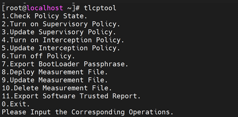
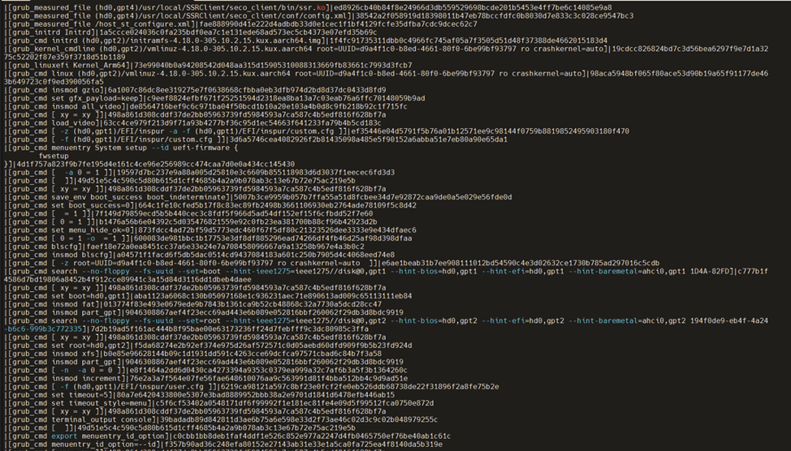

# 国密可信计算

## TPM 2.0

TPM (Trusted Platform Module) 2.0是遵循ISO/IEC 11889系列标准的可信根、由国际可信计算组织TCG（Trusted Computing Group）维护。如下图所示，密码学系统是TPM2.0核心、其所有安全功能均以密码学系统为基础。


目前TPM2.0支持SM2.SM3、SM4特性，具体包括基于SM3的Hash算法、支持SM3 bank的PCR extend；支持SM4加解密；支持SM2加解密、SM2签名验签、SM2+SM3证书签名验签。

龙蜥OS为客户提供了两种使用TPM国密算法引擎的途径：TSS(TrustedSoftwareStack)提供的API访问TPM国密算法、TPMtools中的密码指令使用TPM提供的国密算法

以下示例为使用tpmtools创建基于SM2+SM3-256的认证密钥。

```sh
h_ek_persistent_ecc=0x81010002

tpm2_createak -C ${h_ek_persistent_ecc} -G ecc -g sm3_256 \
    -s sm2 -c ak_ecc.ctx -u ak_ecc.pub -n ak_ecc.name -T device
```

## UEFI 可信启动（Trusted Boot）

可信启动（TrustedBoot)是以可信根为核心、检测系统启动过程中所加载和使用的组件、确保预期的组件在预期的节点加载运行（图1所示）。


图1 可信启动流程示意图

使用国密可信启动的条件如下：

* 硬件要具备的特性：
  - 1.服务器或计算机固件（UEFI）支持基于国密的可信度量特性
  - 2.服务器集成了TPM2.0芯片（该芯片许支持SM3、PCR SM3 Bank等特性
* OS 要具备的特性：
  - 1.部署支持基于国密可信启动的引导程序（grub）
  - 2.部署可信启动策略管理工具（iTrustMidware)
  - **说明**：当以上组件可从Inspur KOS获取，Inspur KOS V5.8是浪潮信息基于龙蜥开源社区最新技术成果自主研发的一款服务器操作系统

1）BIOS国密可信度量Enable方法（如图2所示）：需要将SM3_256 PCR Bank 改为Enable


图2 服务器BIOS Setup界面中国密配置接口

2）OS国密可信度量组件部署方法：

```sh
# grub2系列所有组件（如grub2、grbu2-common、grub2-efi-x64等）均需部署
rpm -ivh grub2-xxx.anolis.x86_64.rpm  
rpm -ivh iTrustMidware-3.0.1-20220827200013.kos.x86_6.rpm
```

3）部署上述组件后、默认支持kernel、initramfs、grubcmdline的国密可信度量


4）如需添加对特定系统程序或配置文件的度量需要进一步配置策略



5）如需添加启动控制策略（在可信度量的基础上、基于国密进一步进行可信验证、需要配置可信启动控制策略。

6）度量结果查看：

直接在 `/sys/kernel/security/tpm0/binary_bios_measurements` 查看

```
0	0d818d47f8b73f1ae27dd82cdcc265aebfd79fd007ab65571c6822c7caacabd0		[S-CRTM Version]	
0	b16790da86a87f9b4cb58f8ae0685c21190efdcc8e90f411fd32edecb84f35bf		[POST CODE]	
7	c3e86209704b2133d5f77fba5ffa3e04ef633729b1ea6086dc6584956db47b6d		[EV_EFI_VARIABLE_DRIVER_CONFIG]	SecureBoot
7	205702258aeaecaf68533e90c2c6cb17cdc1bc34f5c99e0564bb57f5ed3a0e27		[EV_EFI_VARIABLE_DRIVER_CONFIG]	(null)
7	97f842cf8be3ef0c9b1e5fb6d4ab4af26b2943e5ce349883afdf607e81707f7a		[EV_EFI_VARIABLE_DRIVER_CONFIG]	(null)
7	f78247933758602a0e2ba38cdc7efb4b55d4a17f9aec21df6af56d6c7389bb05		[EV_EFI_VARIABLE_DRIVER_CONFIG]	(null)
7	e77ef9cdb81c85e0f9b1a19f7859b762b7b6baafbf4a195eca0b868fa20f8df2		[EV_EFI_VARIABLE_DRIVER_CONFIG]	(null)
7	afcc870fa20c507995499794371e8c25e3a7310fa72200c109379973ae236845		[SEPARATOR]	
2	0e9c74fcdf311f1e4b3e317b28de5e9e4d1463468204d8ae8db7768ddd1f38ef		[EV_EFI_BOOT_SERVICES_DRIVER]
2	0e9c74fcdf311f1e4b3e317b28de5e9e4d1463468204d8ae8db7768ddd1f38ef		[EV_EFI_BOOT_SERVICES_DRIVER]
2	0e9c74fcdf311f1e4b3e317b28de5e9e4d1463468204d8ae8db7768ddd1f38ef		[EV_EFI_BOOT_SERVICES_DRIVER]
2	0e9c74fcdf311f1e4b3e317b28de5e9e4d1463468204d8ae8db7768ddd1f38ef		[EV_EFI_BOOT_SERVICES_DRIVER]
2	caa257fac99df477cf942885b98b98dccf01fdc36136d311da8f65778ade395c		[EV_EFI_BOOT_SERVICES_DRIVER]
2	0f58ef646a55ac70b6a91d3f40fc96f0a2b966db8c7aa271114e93d78be3a057		[EV_EFI_BOOT_SERVICES_DRIVER]
2	0f58ef646a55ac70b6a91d3f40fc96f0a2b966db8c7aa271114e93d78be3a057		[EV_EFI_BOOT_SERVICES_DRIVER]
2	6f6a1dc1bdff4eec695436f59949555da4d60c9c19f9616da8f90cd72c5d0d6a		[EV_EFI_BOOT_SERVICES_DRIVER]
6	36daff67bc46f226c0c0d9398f593f32d06cd7f2a423a763e186c0912f88c3f7		[ ]

0	afcc870fa20c507995499794371e8c25e3a7310fa72200c109379973ae236845		[SEPARATOR]	
1	afcc870fa20c507995499794371e8c25e3a7310fa72200c109379973ae236845		[SEPARATOR]	
2	afcc870fa20c507995499794371e8c25e3a7310fa72200c109379973ae236845		[SEPARATOR]	
3	afcc870fa20c507995499794371e8c25e3a7310fa72200c109379973ae236845		[SEPARATOR]	
4	afcc870fa20c507995499794371e8c25e3a7310fa72200c109379973ae236845		[SEPARATOR]	
5	afcc870fa20c507995499794371e8c25e3a7310fa72200c109379973ae236845		[SEPARATOR]	
6	afcc870fa20c507995499794371e8c25e3a7310fa72200c109379973ae236845		[SEPARATOR]	
5	0b744bb2a83c1972bc2bc332d0106a9eb649e3f275aeb1c8df33c9d03cbf2ee5		[EV_EFI_GPT_EVENT]	EFI System Partition
1	506c89ec72f49008654f96e1b631e94771d3869cd5a11eb579226a6683ddb1ee		[EV_EFI_VARIABLE_BOOT]	BootOrder
1	48bc055085b9bbd648d745daff7f7e04fec266d0d2eb7ed7b1235344252a1700		[EV_EFI_VARIABLE_BOOT]	Boot0000
1	bf48f4d43b45c7e714cc5d61ff53f3b17240a28adb80f38caf10ebee5d5b9907		[EV_EFI_VARIABLE_BOOT]	Boot0001
4	1b5f3591405418a6d2cda86e1fd6b498352406b247e9d5e43b8a57b9f22954f5		[EV_EFI_BOOT_SERVICES_APPLICATION]	/Pci(0x0,0x0)/Pci(0x0,0x0)/Ctrl(0x0)/SCSI(0,0)/HD(1,GPT,b70487f0-7ce2-448e-9665-0366af0df695,0x800,0x12c000)/File(\EFI\kos\SHIMX64.EFI)
14	ea9e5e0a8e5a19bc3d7b1ea0f250a6d2500208278a99dec5baba3cacf53ac351		[IPL]	MokList
14	9938145964640087730b5a8978b4af58bed8ee6b14abf302f8c7e8b66f91a6d2		[IPL]	MokListX
7	54ec273cb36f668364085a297dc41c0d479e439934fac9d22246f28fa7fb719f		[ ]

7	d1baeeb2a8780c608a3c76815b887422fe79f053a23f9ed95ee7c3786d25b655		[ ]

14	799b719ac031fc89c6d8925a487dad07308f837b7ab7bbc7cebd3a4118fd2f38		[IPL]	MokListTrusted
4	e113a622221b0aee72e01ad3947bf460c1aef083a63a1ff42cfbda4d5ffc4f90		[EV_EFI_BOOT_SERVICES_APPLICATION]	File(\EFI\kos\grubx64.efi)
8	a39effb1bce1f98b192cfe29077101abd8154c665fc26b94a123d148fbe88905		[IPL]	grub_cmd set pager=1
8	2836d0a014d8fab799dfdd58e818f27df898b79787cb6125e14fe15d1a19327c		[IPL]	grub_cmd [ -f (hd0,gpt1)/EFI/kos/grubenv ]
8	db5afd58eb43d042bacf6efc109156ba65d249b1a631b5f439f4e4f5e9250ab1		[IPL]	grub_cmd load_env -f (hd0,gpt1)/EFI/kos/grubenv
8	49d51e5c4c590c5d80b615d1cff4685b4a2a9b078ab3c13e67b72e75ac219e5b		[IPL]	grub_cmd [  ]
8	7c7e34aa168d85a766233c27f51ce996039348cbf52a5941f044c0da0e5bf408		[IPL]	grub_cmd set default=70fc47cdedcf464f99c49e2b6bac3890-4.18.0-372.26.1.kos.x86_64
8	498a861d308cddf37de2bb05963739fd5984593a7ca587c4b5edf816f628bf7a		[IPL]	grub_cmd [ xy = xy ]
8	f357b90ad36c248efa80152e27143ab31e33e1a5ca0fa725ea4f8140da5b319e		[IPL]	grub_cmd menuentry_id_option=--id
8	c0cbb1bb8deb1faf4ddf1e526c852e977a2247d4fb0465750ef76be40ab1c61c		[IPL]	grub_cmd export menuentry_id_option
8	49d51e5c4c590c5d80b615d1cff4685b4a2a9b078ab3c13e67b72e75ac219e5b		[IPL]	grub_cmd [  ]
8	39badadb89d842811d3ae6b75a6e598e33d2f73ae46c02d3c9c02b048979255c		[IPL]	grub_cmd terminal_output console
8	498a861d308cddf37de2bb05963739fd5984593a7ca587c4b5edf816f628bf7a		[IPL]	grub_cmd [ xy = xy ]
8	c5f6cf53402a0548171df6f99992f1e181ec81fe4e09d5f99512fca0750e872d		[IPL]	grub_cmd set timeout_style=menu
8	80a7e6420433800e5307e3bad8889952bbb38a2e9701d1841d6478efb446ab15		[IPL]	grub_cmd set timeout=5
8	8f4a599975cee5e2a200b00cb2cabcac0b954cc7d52ac8e5632771457f8ef059		[IPL]	grub_cmd set tuned_params=
8	4c187b98f26d298b468fcd61bf93d4acabdee1afa6dada74d9392b9ed5543652		[IPL]	grub_cmd set tuned_initrd=
8	8dc82b04c088d2dd3610bcd70a9afc7d989cc39f22926bc0c9e39bba7775dbcd		[IPL]	grub_cmd [ -f (hd0,gpt1)/EFI/kos/user.cfg ]
8	76e2a3a7f564e07fe56fae648610076aa9c563991d81f4bba512bb4c9d9ad51e		[IPL]	grub_cmd insmod increment
8	e8f1464a2dd6d0430ca4273394a9353c0379ea999a32c7af6b3a5f3b1364260c		[IPL]	grub_cmd [ -n  -a 0 = 0 ]
8	9046308867aef4f23ecc69ad443e6b089e052816bbf260062f29db3d8bdc9919		[IPL]	grub_cmd insmod part_gpt
8	b0e85e96628144b09c1d1931dd591c4263cce69dcfca97571cbad6c84b7f3a58		[IPL]	grub_cmd insmod xfs
8	f5da68274e2b92ef374e975d26af572571c0d05aebd60dfd909f9b5b23fd924d		[IPL]	grub_cmd set root=hd0,gpt2
8	498a861d308cddf37de2bb05963739fd5984593a7ca587c4b5edf816f628bf7a		[IPL]	grub_cmd [ xy = xy ]
8	ea3e9c8e779d370f5bc02bd0c8337c2f92e7e33ebf696c32fd9c57ce905559fe		[IPL]	grub_cmd search --no-floppy --fs-uuid --set=root --hint-bios=hd0,gpt2 --hint-efi=hd0,gpt2 --hint-baremetal=ahci0,gpt2 47737060-4687-4389-a391-c9de948ce7c0
8	9046308867aef4f23ecc69ad443e6b089e052816bbf260062f29db3d8bdc9919		[IPL]	grub_cmd insmod part_gpt
8	013774f83e493e0679ede9b7843b1361ca9b52cb48868c32a7730a5dcd28cc47		[IPL]	grub_cmd insmod fat
8	aba1123a6068c130b05097168e1c936231aec71e890613ad009c65113111eb84		[IPL]	grub_cmd set boot=hd0,gpt1
8	498a861d308cddf37de2bb05963739fd5984593a7ca587c4b5edf816f628bf7a		[IPL]	grub_cmd [ xy = xy ]
8	a96cb589be44f98539a19d73e9d6f82053ab7a31e52d12da58c0f38bd2ef8025		[IPL]	grub_cmd search --no-floppy --fs-uuid --set=boot --hint-bios=hd0,gpt1 --hint-efi=hd0,gpt1 --hint-baremetal=ahci0,gpt1 5B14-A594
8	865439edec9f27dabe698315dae4e97448c538f23243881eaf557e57e259ddab		[IPL]	grub_cmd [ -z root=/dev/mapper/ao-root ro crashkernel=auto resume=/dev/mapper/ao-swap rd.lvm.lv=ao/root rd.lvm.lv=ao/swap rhgb quiet  ]
8	a04571f1facd6f5db5dac0514cd9437084183a601c250b7905d4c4068eed74e8		[IPL]	grub_cmd insmod blscfg
8	faef18e72a0ea8451cc37a6e33e24e7a708458096667a9a13258b967e4a3b0c2		[IPL]	grub_cmd blscfg
8	600083de981bbc1b17753e3df8df885296ead74266df4fb46d25af98d398dfaa		[IPL]	grub_cmd [ 0 = 1 -o  = 1 ]
8	873fdcc4ad72bf59d5773edc460f67f5df80c21323526dee3333e9e434dfaec6		[IPL]	grub_cmd set menu_hide_ok=0
8	b1476a56b6e04392c5d035476821559e92c0fb23ea381700b88cf96b42923d2b		[IPL]	grub_cmd [ 0 = 1 ]
8	7f149d79859ecd5b5b440cec3c8fdf5f966d5ad54df152ef15f6cfbdd52f7e60		[IPL]	grub_cmd [  = 1 ]
8	664c1fe10cfed5b17f8c83ec89fb2498b3661106930eb2764ade78109f5c8d42		[IPL]	grub_cmd set boot_success=0
8	5007b3ce9959b057b7ffa55a51d8fcbee34d7e92872caa9de0a5e029e56fde0d		[IPL]	grub_cmd save_env boot_success boot_indeterminate
8	498a861d308cddf37de2bb05963739fd5984593a7ca587c4b5edf816f628bf7a		[IPL]	grub_cmd [ xy = xy ]
8	49d51e5c4c590c5d80b615d1cff4685b4a2a9b078ab3c13e67b72e75ac219e5b		[IPL]	grub_cmd [  ]
8	19597d7bc237e9a88a005d25810e3c6609b855118983d6d3037f1eecec6fd3d3		[IPL]	grub_cmd [  -a 0 = 1 ]
8	4d1f757a823f9b7fe195d4e161c4ce96e256989cc474caa7d0e0a434cc145430		[IPL]	grub_cmd menuentry System setup --id uefi-firmware {
	fwsetup
}
8	9f60d5ba77b05d019ea64119f9d5f9e5a8cc6868e8652e83abed352cde7e1418		[IPL]	grub_cmd [ -f (hd0,gpt1)/EFI/kos/custom.cfg ]
8	a5834c9fefcca2e157a3ff8357d817d8251f5d0bb5bdf0f98eecc136e2aeb166		[IPL]	grub_cmd [ -z (hd0,gpt1)/EFI/kos -a -f (hd0,gpt1)/EFI/kos/custom.cfg ]
8	63cc4ce979f213d9f71a93b4277bf36c95d1ec54663f641233fa79b4b5cd183c		[IPL]	grub_cmd load_video
8	498a861d308cddf37de2bb05963739fd5984593a7ca587c4b5edf816f628bf7a		[IPL]	grub_cmd [ xy = xy ]
8	de8564716bef9c6c971ba04f50bcd1b10a20e103a4b0d8c9fb218b92c1f715fc		[IPL]	grub_cmd insmod all_video
8	c9eef8824efbf671f25251594d2318ea8ba13a7c03eab76a6ffc70148059b9ad		[IPL]	grub_cmd set gfx_payload=keep
8	6a1007c86dc8ee319275e7f0638668cfbba0eb3dfb974d2bd8d37dc0433d8fd9		[IPL]	grub_cmd insmod gzio
8	eb204c91fc3dcc42968f4110285d3c265ec735943cf3b34f5b5992cccd07b1a0		[IPL]	grub_cmd linux (hd0,gpt2)/vmlinuz-4.18.0-372.26.1.kos.x86_64 root=/dev/mapper/ao-root ro crashkernel=auto resume=/dev/mapper/ao-swap rd.lvm.lv=ao/root rd.lvm.lv=ao/swap rhgb quiet
9	3e9ff31a468703754a43ae6fc3a20d4ba8fdb3e38b2a94daa5044ad0da4628a0		[IPL]	grub_linuxefi Kernel
8	d6b9a9c618acfef160388388225d80adaf6f8e5804beeea954b23de51d10d1da		[IPL]	grub_kernel_cmdline (hd0,gpt2)/vmlinuz-4.18.0-372.26.1.kos.x86_64 root=/dev/mapper/ao-root ro crashkernel=auto resume=/dev/mapper/ao-swap rd.lvm.lv=ao/root rd.lvm.lv=ao/swap rhgb quiet
8	603cfbaa83759e9579df8526a21093c4e9851ff3bdd7c40a1284cae6467c0fae		[IPL]	grub_cmd initrd (hd0,gpt2)/initramfs-4.18.0-372.26.1.kos.x86_64.img
9	f0ba7132cceaea8cb7ea4066406099d48b7ff493fa6da8753c845bce861c1862		[IPL]	grub_linuxefi Initrd
```

使用iTrustMidware提供的策略管理工具查看（如图3所示）



图3 度量结果截图

## TPM 国密证书部署与远程证明

远程证明是可信计算中实现节点可信认证的关键设施，是实现可信节点之间可信互联的依据。KOS（Anolis 衍生发行版）在RSA+ SHA256+ AES和ECDSA+SHA256+AES的基础上拓展支持了基于TPM2.0国密的远程证明特性。

1）在KOS部署可信代理端之后、配置后可在可信管理端识别到响应的节点、之后通过可信管理端部署相应节点的国密远程认证证书（Attestation Certification)（如图4所示）。


图4 节点国密可信证书信息

2）部署可信证书后、节点即可以远程证明的方式向可信管理端发送报告进行可信证明（如图5所示）。


图5 可信管理段接收到的国密可信报告

{{#template ../template/footer.md}}
