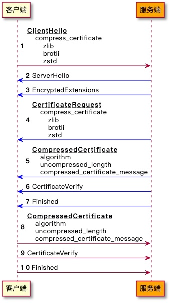

# 证书压缩（RFC 8879）

## 前言

随着 5G 网络的建设，加速了移动互联网应用的发展，包括短视频、在线教育、物联网等领域。但是在现实生活中，依然存在网络信号不好的场景，包括地下商场、车库、地铁等地方，或者是由于网络拥塞导致的弱网环境下，应用在使用过程中加载缓慢，导致用户体验变差。这时候就需要对弱网环境进行优化，而手段之一就是想办法降低网络数据传输。

为了保障数据的安全性，通常使用 TLS/SSL 进行加密传输。当客户端访问服务器后台时，客户端会先和服务器进行 TLS 握手。在 TLS 完整握手时，服务端会发送证书链用于身份认证，而握手时数据传输的大部分都来自于证书。

有什么办法可以减少 TLS 握手的带宽消耗呢？如果证书可以被压缩，甚至“消失”，那就可以大大降低数据传输。RFC 8879 TLS Certificate Compression 就是为了解决这个问题，在 TLS 1.3 握手时提供证书压缩功能。

## TLS 证书压缩介绍



1. 如果客户端支持证书压缩，在 ClientHello 消息中携带 compress_certificate 扩展，该扩展中包含支持的压缩算法列表；
2. 服务端收到 ClientHello，发现对方支持证书压缩，如果服务端也支持证书压缩，同时支持客户端声明的压缩方法，则使用该算法压缩 Certificate 消息；
3. 服务端发送 CompressedCertificate 消息，代替原来的 Certificate 消息，CompressedCertificate 消息中包含压缩算法，解压后的长度和压缩的 Certificate 消息；
4. 客户端收到 CompressedCertificate 消息后，使用其中的 algorithm 解压，如果解压成功，则进行后续处理，否则关闭连接并发送 bad_certificate 警告。服务端发送 CertificateRequest 消息，然后客户端发送 CompressedCertificate 消息的处理流程和上述类似，不再赘述。

标准中定义的压缩算法：

| 算法   | 值 | 参考标准 |
| ------ | -- | -------- |
| zlib   |  1 | RFC 1950 |
| brotli |  2 | RFC 7932 |
| zstd   |  3 | RFC 8478 |

除了 RFC 中定义的这 3 种算法，用户还可以使用其他算法，值 16384 到 65535 用于留给用户自已使用。

## 实战TLS证书压缩

开源 Tongsuo 密码库已经支持 TLS 证书压缩功能，需要在构建 Tongsuo 时开启该功能，config 后添加参数 `enable-cert-compression`。

可以在设置 SSL_CTX 时，添加证书压缩算法，代码示例如下：

```c
#include <openssl/ssl.h>
#include <zlib.h>

static int
zlib_compress(SSL *s, const unsigned char *in, size_t inlen,
              unsigned char *out, size_t *outlen)
{
    if (out == NULL) {
        *outlen = compressBound(inlen);
        return 1;
    }
    if (compress2(out, outlen, in, inlen, Z_DEFAULT_COMPRESSION) != Z_OK)
        return 0;
    return 1;
}

static int
zlib_decompress(SSL *s, const unsigned char *in, size_t inlen,
                unsigned char *out, size_t outlen)
{
    size_t len = outlen;
    if (uncompress(out, &len, in, inlen) != Z_OK)
        return 0;
    if (len != outlen)
        return 0;
    return 1;
}

int main()
{
    const SSL_METHOD *meth = TLS_client_method();
    SSL_CTX *ctx = SSL_CTX_new(meth); 
    /* 配置证书、私钥... */
    
    /* 例如：设置压缩算法为zlib */
    SSL_CTX_add_cert_compression_alg(ctx, TLSEXT_cert_compression_zlib,
                                    zlib_compress, zlib_decompress);
    SSL *con = SSL_new(ctx);
    
    /* 握手... */
    
    return 0;
}
```

也可以使用 Tongsuo 提供的 s_client 和 s_server 来使用 TLS 证书压缩功能：

```sh
# 服务端
openssl s_server \
    -accept 127.0.0.1:34567 \
    -cert server.crt -key server.key \
    -tls1_3 -cert_comp zlib -www -quiet

# 客户端
openssl s_client \
    -connect 127.0.0.1:34567 \
    -tls1_3 -cert_comp zlib -ign_eof -trace
```

## 测试压缩算法和压缩率

服务端配置证书链，CA 证书 + 中间 CA + 域名证书，TLS 1.3 握手且开启证书压缩，对比各个压缩算法的压缩率如下：

| 压缩算法    | 压缩前 | 压缩后 | 压缩率 | 备注                         |
| ----------- | ------ | ------ | ------ | ---------------------------- |
| zlib        |   2666 |   1959 | 73.48% | 使用默认压缩级别 6           |
| brotli      |   2666 |   1889 | 70.86% | 使用默认压缩级别 11          |
| zstd        |   2666 |   1951 | 73.18% | 使用默认压缩级别 3           |
| zstd + 字典 |   2666 |     18 |  0.68% | 字典基于Certificate 消息训练 |

有些压缩算法是支持设置字典的，比如 brotli、zstd。可以提前计算好字典内容，预埋到客户端和服务端，然后在压缩和解压的时候使用该字典，可以让证书链完美“消失”。例如上表中使用 zstd + 字典时，压缩前的 Certficate 消息为 2666 字节，压缩后只有 18 字节。

开启证书压缩功能后，可以大大降低握手时的传输，尤其是使用字典时，例如 zstd + 字典时数据如下：

关闭证书压缩，握手共传输：3331 字节

开启证书压缩：握手共传输：698 字节

压缩率：698/3331 * 100% = 20.95%，握手带宽降低接近 80%。

## 结语

TLS 会话复用时不需要发送证书，所以，在完整握手时，就可以通过证书压缩来优化。在双向认证的场景下，即服务端开启了客户端认证，如果客户端和服务端都开启 TLS 证书压缩功能，压缩效果更明显，可以节省 TLS 握手中 80% 以上的带宽。后面 Tongsuo 还会支持 Compact TLS 1.3，即 TLS 1.3 的袖珍版，保持协议同构的前提下，占用最小的带宽。

{{#template template/footer.md}}
