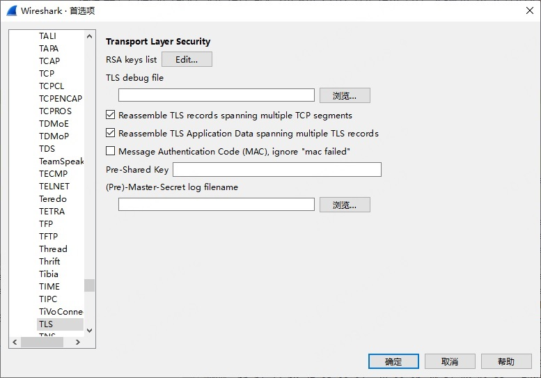
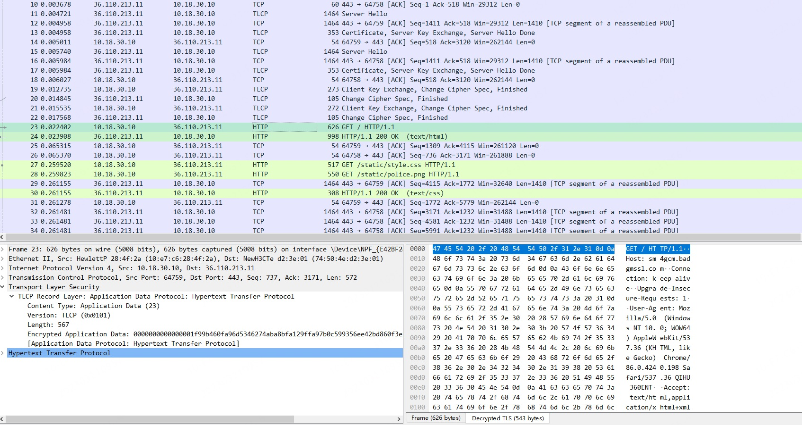

# Wireshark国密调试实践

## 前言

[wireshark](https://www.wireshark.org/) 是开源的包分析工具，被广泛应用于网络调试中。在国密开发者的贡献下，wireshark4.0已支持导入预主密钥解密国密协议和[RFC8998](https://datatracker.ietf.org/doc/html/rfc8998)的流量。可以用于上述协议的调试和分析。

## 安装

wireshark的加解密功能依赖于[libgcrypt](https://git.gnupg.org/cgi-bin/gitweb.cgi?p=libgcrypt.git)，libgcrypt1.9开始支持sm3和sm4算法。wireshark中国密协议的支持依赖于编译时libgcrypt的版本，目前wireshark官方下载的windows版本已内置libgcrypt1.10.1，可支持导入预主密钥解密国密协议和RFC8998流量。但linux和mac版本需更新libgcrypt版本到1.9.0或之后的版本并编译后才可支持。编译步骤可参考[编译文档](https://www.wireshark.org/docs/wsdg_html_chunked/ChapterSetup.html#ChSetupUNIX)。

## 调试

wireshark需导入预主密钥才可解密国密协议或RFC8998流量。

### 导出预主密钥

#### 浏览器导出预主密钥

基于chromium的国密浏览器如[360安全浏览器](https://browser.360.net/gc/)，一般都支持通过命令行参数`--ssl-key-log-file=path`的方式导出预主密钥。

#### 网络程序导出预主密钥

使用基于openssl/Tongsuo的应用程序可以使用环境变量`SSLKEYLOGFILE=sslkey.log`的方式导出预主密钥，如`SSLKEYLOGFILE=sslkey.log curl -s https://example.com`。

### 导入预主密钥

在wireshark的菜单中导入预主密钥，具体路径为`编辑-首选项-展开protocol列表-tls`,在`(Pre)-Master-Secret log filename`中添加导出的预主密钥。

打开捕获到的国密数据包，即可看到解密后的国密流量或者rfc8998流量。

{{#template template/footer.md}}
